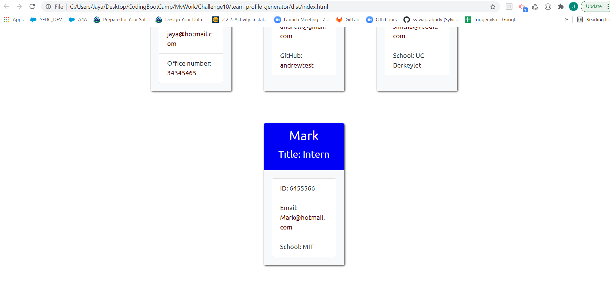
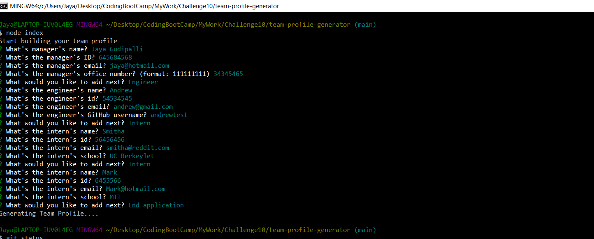

# team-profile-generator

Deployed application: https://jaya1983.github.io/team-profile-generator/

Walkthrough video: https://drive.google.com/file/d/1M53pmbmvLpKoEZpAYpJg9GBFUiEKAAlM/view

Github: https://github.com/jaya1983/team-profile-generator

Description:
a Node.js command-line application that takes in information about employees on a software engineering team and generates an HTML webpage that displays summaries for each person.

User Story:
AS A manager
I WANT to generate a webpage that displays my team's basic info
SO THAT I have quick access to their emails and GitHub profiles

Usage:
This application is used to genearte a team profile based on the input provided by the user.
User will be prompted to enter with the team Manager's details - Name, Id, Email and Phone #. For Phone #, there is a validation to check for a valid phone number.
Then the next step is to make a selection for the team members for an engineer/intern/end application.
Based on the user provided answers, engineer details and Intern details will be used to create the html.
Once user chooses to end the application, html file is generated in the dist folder.
The HTML file is created with the data entered by the user.
When user click on an email address in the HTML, default email program opens and populated the TO field of the email with the address
When user click on the GitHub username, then that GitHub profile opens in a new tab

Screenshots:

## Screenshots

Technologies Used:
Node.js

NPM

Inquirer.js

Jest

Bootstrap

Contributor:
Jaya Gudipalli ©2021 All Rights Reserved.